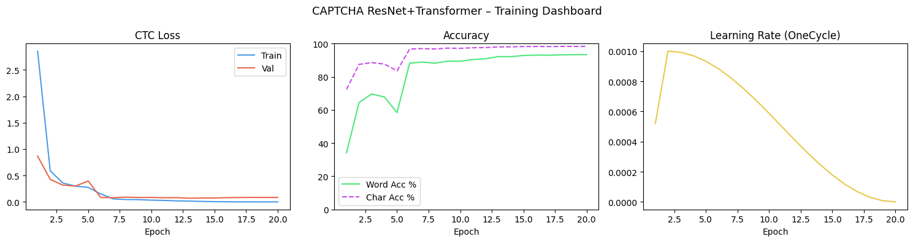

# Evaluating CAPTCHA Distortions with Deep Learning: Can we beat the CAPTCHA?

This project's goal is to investigate the robustness of modern deep learning Optical Character Recognition (OCR) systems againts synthetic CAPTCHA-like distortions.
Using a **ResNet CNN + Transformer** architecture trained with CTC loss, we evaluate how different distortion types and severity levels impact the machine's text recognition performance, and compare these results to 
A high-performance CAPTCHA recognition system using a **ResNet CNN + Transformer** architecture, trained end-to-end with CTC loss on 113,000+ images.

## Research Objectives
# 🔐 Deep Learning CAPTCHA & Handwriting Recognizer

A recognition system for **CAPTCHAs and handwriting** using Deep Learning.  
Available in two versions: a high-performance version for powerful PCs and a lightweight version for weaker hardware.

---

This project aims to answer the following questions:

- Which CAPTCHA-style distortions most effectively reduce OCR performance?
- Which distortions impact humans more than machines (Qualitative Assessemnt with class if time allows)?
- Hows does the model accuracy degrade as distortion severity increases?
- Can modern OCR architectures reliably solve heavily distorted synthetic CAPTCHAs?

## Distortion Benchmarking

Synthetic CAPTCHA images are generated with controlled distortions, including:

- Rotation
- Gaussian blur
- Noise injection
- Character overlap
- Perpective warping
- Background clutter (ex. lines, dots etc.)
- Occlusion lines (foreground)
- Font variation (consider use cases for old German font?)


## Authors

| Name | Role |
|------|------|
| **Benedikt** | Model Architecture, Training Pipeline |
| **Luka** | Data Processing, Inference & Evaluation |

---

## Project Structure

```
Deep_Larning_Captcha/
│
├── train.py          # Training script
├── inference.py      # Inference script (single image & batch)
├── README.md         # This file
└── .gitignore        # Excludes model weights & cache


Chars74K (Character-level backbone for pretraining)
    ↓
CNN backbone pretraining
    ↓ 
Synthetic CAPTCHA sequence training (use this for controlled distortions)
    ↓
Distortion robustness evaluation
    ↓
Real CAPTCHA generalization testing

## Architecture
Input Image (160 × 48 px)
│
▼
┌───────────────────┐
│  ResNet CNN       │  4 ResBlocks (stride-2)
│  Backbone         │  32 → 64 → 128 → 256 channels
└───────────────────┘
│
▼
┌───────────────────┐
│  Linear           │  Feature projection → d_model=256
│  Projection       │
└───────────────────┘
├── .github/
│   └── workflows/
│       └── ci.yml                        # CI/CD Pipeline
│
├── src/
│   ├── Deep_Learning_Captcha.py          # Training script (GPU, high-performance)
│   ├── Read_Captcha_Traind_Modell.py     # Inference script
│   ├── classify.py                       # Classification (standard version)
│   └── classify_optimized.py            # Classification (RAM-optimized, powerful PC)
│
├── models/
│   ├── Deep_2_1.pth                      # CAPTCHA model v2.1 (ResNet+Transformer)
│   ├── ...                               # Further pre-trained models (coming soon)
│   └── README_models.md                  # Description of all available models
│
├── plots/
│   └── training_results_epoch20_acc93.png
│
├── README.md
├── LICENSE
├── requirements.txt                      # GPU version dependencies
├── requirements_cpu.txt                  # CPU version dependencies (coming soon)
└── environment.yml                       # Conda environment (GPU)
```

---

## 🖥️ Versions Overview

| Version | Hardware | Description | Status |
|---------|----------|-------------|--------|
| **GPU / High-performance** | Powerful PC + NVIDIA GPU | Full model, fast training & inference | ✅ Available |
| **CPU / Lightweight** | Any PC, no GPU needed | Optimized for weak hardware | 🔜 Coming soon |

---

## 🧠 Available Models

| Model | Task | Architecture | Accuracy | Dataset | Status |
|-------|------|-------------|----------|---------|--------|
| `Deep_2_1.pth` | CAPTCHA recognition | ResNet + Transformer | 93% Word / 96% Char | [CAPTCHA Dataset](https://www.kaggle.com/datasets/parsasam/captcha-dataset) | ✅ Available |
| Handwriting model | Handwriting recognition | TBD | TBD | TBD | 🔜 Coming soon |
| Lightweight model | CAPTCHA (weak PC) | TBD | TBD | TBD | 🔜 Coming soon |

> All models can be used with the classification scripts (`classify.py` / `classify_optimized.py`)

---

## 📊 Model Architecture (ResNet + Transformer)


| Step | Layer | Details |
|------|-------|---------|
| 1 | **Input** | 160 × 48 px grayscale image |
| 2 | **ResNet CNN backbone** | 4 ResBlocks (stride-2) · 32 → 64 → 128 → 256 channels |
| 3 | **Linear projection** | Feature map → d_model = 256 |
| 4 | **Positional encoding** | Sinusoidal · adds position info to sequence |
| 5 | **Transformer encoder** | 4 layers · 8 attention heads · Pre-LN · FFN dim 1024 |
| 6 | **CTC head** | 62 classes (a–z, A–Z, 0–9) + blank token |
| 7 | **Decoding** | Greedy (fast) or Beam Search width=5 (accurate) |
| 8 | **Output** | Predicted text string |


---

## Model Details

| Parameter | Value |
|-----------|-------|
| CNN Backbone | ResNet (4 ResBlocks) |
| Sequence Model | Transformer Encoder |
| d_model | 256 |
| Attention Heads | 8 |
| Transformer Layers | 4 |
| Feedforward Dim | 1024 |
| Optimizer | AdamW |
| Scheduler | OneCycleLR |
| Loss Function | CTC Loss |
| Charset | a–z, A–Z, 0–9 (62 classes) |
| Blank Index | 62 |
| Image Size | 160 × 48 px |
| Batch Size | 128 |
| Epochs | 20 |
| AMP | float16 mixed precision |
| Gradient Clipping | max norm 5.0 |

---

## Dataset

**[CAPTCHA Dataset – Kaggle](https://www.kaggle.com/datasets/parsasam/captcha-dataset)**

| Split | Size |
|-------|------|
| Train | 80% (~90,400 images) |
| Validation | 10% (~11,300 images) |
| Test | 10% (~11,300 images) |
| **Total** | **~113,000 images** |

---

## Results

| Metric | Greedy Decoding | Beam Search (width=5) |
|--------|-----------------|-----------------------|
| Word Accuracy | ~93% | TBD |
| Char Accuracy | ~99% | TBD |



---

### Evaluation Metrics

- Character Error Rate (CER)
- Sequence Accuracy
- Accuracy vs Distortion Severity
- Humna vs Machine Accuracy
- Inference Confidence Scores

## Setup & Usage

### 1. Install Dependencies

**With GPU (NVIDIA CUDA):**
```bash
pip install torch torchvision --index-url https://download.pytorch.org/whl/cu121
pip install -r requirements.txt
```

**Without GPU (CPU only):**
```bash
pip install torch torchvision --index-url https://download.pytorch.org/whl/cpu
pip install -r requirements.txt
```

**With Conda (recommended):**
```bash
conda env create -f environment.yml
conda activate torch_gpu
```

### 2. Download Dataset

```bash
pip install kagglehub
python -c "import kagglehub; kagglehub.dataset_download('parsasam/captcha-dataset')"
```

### 3. Training

```bash
python src/Deep_Learning_Captcha.py
```

Training outputs:
- Live plot (Loss, Accuracy, Learning Rate)
- Best model saved as `models/best_captcha_model.pth`
- Per-epoch console output with example predictions

### 4. Inference / Classification

**Standard version** (works on any PC):
```bash
python src/classify.py
```

**Optimized version** (loads all data into RAM — for powerful PCs):
```bash
python src/classify_optimized.py
```

Two modes:
- **Mode 1** — Single image with visualization
- **Mode 2** — Batch prediction on an entire folder

---

## CTC Decoding

**Greedy Decoding**  
Fast — picks the most likely character at each timestep. Ideal for batch evaluation.

**Beam Search (width=5)**  
Explores multiple paths simultaneously. Slightly more accurate, used for single-image inference.

---

## Data Augmentation
## ⚡ Performance Optimizations

| Optimization | Description |
|---|---|
| AMP | float16 mixed precision — reduces memory, speeds up training |
| RAM preloading | Entire dataset loaded into RAM before training (optimized version) |
| pin_memory | Fast CPU→GPU data transfers |
| cudnn.benchmark | Optimized CUDA kernels |

---

## 💾 Data Augmentation

| Augmentation | Parameter |
|---|---|
| ColorJitter Brightness | ±0.2 |
| ColorJitter Contrast | ±0.2 |
| ColorJitter Saturation | ±0.1 |

---

## Performance

- Entire dataset is loaded into RAM before training for maximum speed
- AMP (Automatic Mixed Precision) reduces memory usage and speeds up training
- `pin_memory=True` + `non_blocking=True` for fast CPU→GPU transfers
- `torch.backends.cudnn.benchmark = True` for optimized CUDA kernels

---

## .gitignore

## Ethical Use

This project is intended for educational and research purposes only. 
The CAPTCHA images are synthetically generated and are not intended to bypass real-world security systems.

## License
## 📄 License

This project is licensed under the MIT License — see the [LICENSE](LICENSE) file for details.
